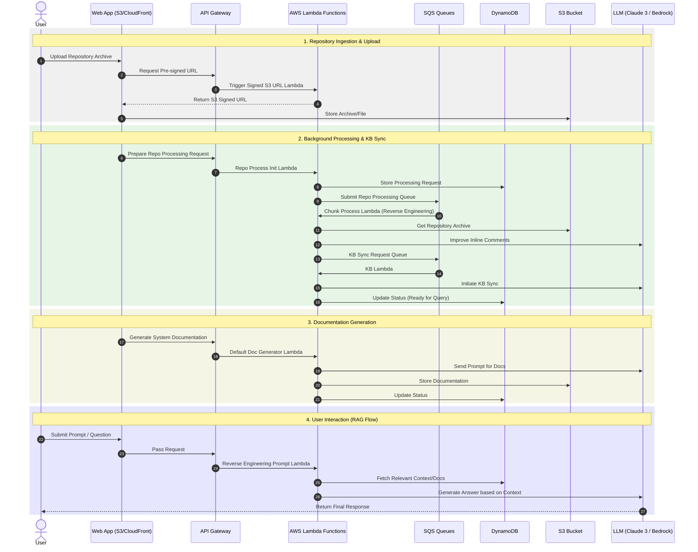

# System Sequence Diagram

This diagram illustrates the operational flows of the Reverse Engineering Agent system, derived from the logic in `code_explain_diagram.py` and the application setup.

### Key Components:
- **Auth Layer (not in diagram):** Handled via Amazon Cognito before reaching the API Gateway.
- **Notification:** SES is used to notify users upon completion of processing steps.
- **Queueing:** SQS ensures asynchronous processing of large repository files without blocking the UI.
