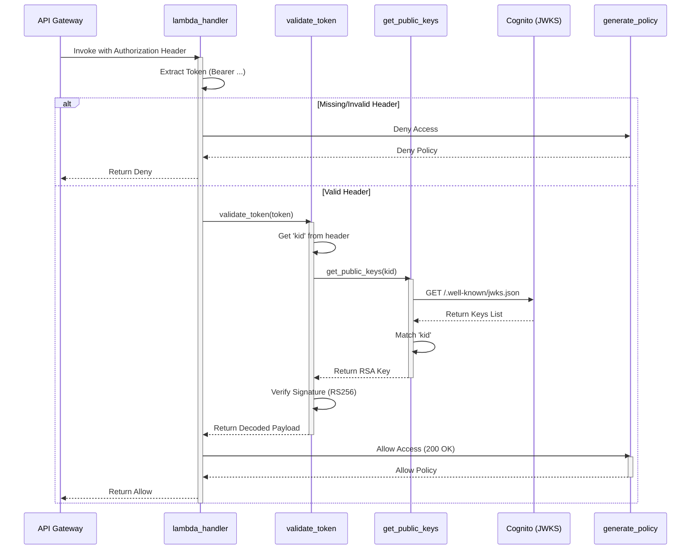

# Logic Trace: Authorizer Execution Flow

This document traces the step-by-step execution of `authorizer.py` when triggered by an AWS API Gateway event.

## 1. Entry: `lambda_handler(event, context)`
The execution starts here when API Gateway sends an authorization request.

1.  **Logging**: The incoming `event` is logged for debugging.
2.  **Extraction**: The code looks for the `Authorization` (or `authorization`) header.
3.  **Validation Check**:
    *   If the header is missing or doesn't start with `Bearer ` (case-insensitive), it immediately returns a **Deny** policy via `generate_policy`.
    *   Otherwise, it strips the `Bearer ` prefix to get the raw JWT `token`.

## 2. Validation: `validate_token(token)`
Called by the handler to verify the JWT's integrity.

1.  **Header Parsing**: `jwt.get_unverified_header(token)` extracts the `kid` (Key ID) without verifying the signature yet.
2.  **Key Retrieval**: It calls `get_public_keys(kid)` to find the matching RSA public key.
3.  **Public Key Fetching (`get_public_keys`)**:
    *   Downloads the JWKS (JSON Web Key Set) from the Cognito `JWKS_URL`.
    *   Iterates through the keys to find one with a matching `kid`.
    *   Returns the key components (`n`, `e`, etc.).
4.  **Signature Verification**: `jwt.decode` uses the retrieved RSA key to verify the token's signature using the `RS256` algorithm.
5.  **Payload Return**: If valid, the decoded `payload` is returned to the handler.

## 3. Response: `generate_policy(...)`
Called to construct the response for API Gateway.

1.  **Structure**: It builds a dictionary containing:
    *   `principalId`: Usually set to `"user"`.
    *   `policyDocument`: A standard AWS IAM Policy allowing/denying `execute-api:Invoke` on the requested `methodArn`.
    *   `context`: Custom JSON metadata (code, message, error) passed to the backend.
2.  **Result**: This structured JSON is returned to API Gateway.

---

## Visual Sequence Diagram

